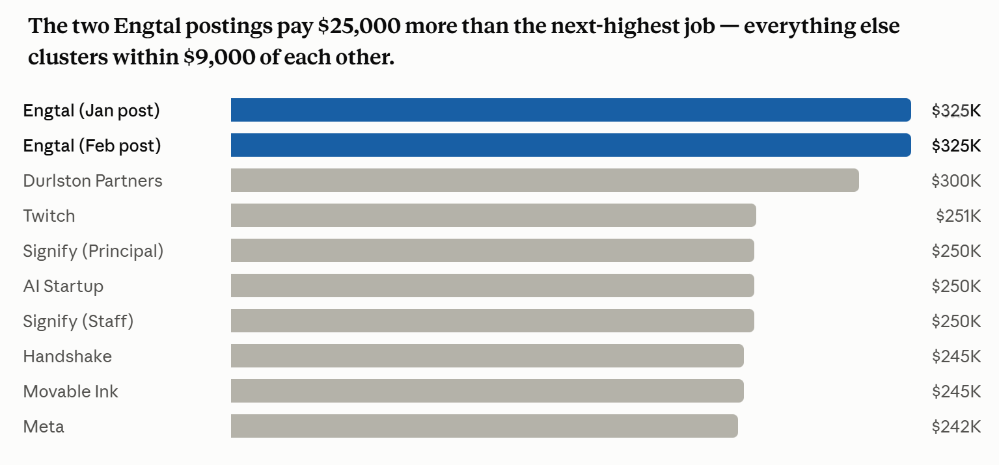
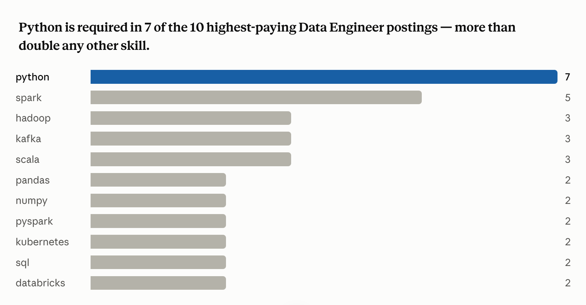

# Data Engineer Job Market Analysis (SQL Project)

## Introduction
This project looks at the data engineering job market. Using SQL, I explore which jobs pay the most, which skills companies ask for the most, and which skills give you both strong demand and strong pay.

SQL queries? Check them out here: [project_sql folder](/project_sql/)

## Background
I wanted a better way to understand the data engineering job market. This project helped me find which skills are the highest paid, which skills are the most requested, and how data engineers actually use SQL to explore job data.

The data comes from Luke Barousse's [SQL for Data Analytics course](https://youtu.be/7mz73uXD9DA). It includes job titles, salaries, locations, and skills for real job postings.

### Questions I Wanted to Answer
1. What are the top-paying data engineering jobs?
2. What skills are required for these top-paying jobs?
3. What skills are most in demand for data engineers?
4. Which skills are associated with higher salaries?
5. What are the most optimal skills to learn?

## Tools I Used
- **SQL:** The main tool I used to explore the database and find answers to my questions.
- **PostgreSQL:** The database system that stored all the job posting data.
- **Visual Studio Code:** Where I wrote and ran my SQL queries.
- **Git & GitHub:** Used to save my work and share my SQL scripts with others.

## The Analysis

### 1. Top Paying Data Engineer Jobs
To find the highest-paying jobs, I filtered for Data Engineer roles that are fully remote and have a listed salary. This shows the best-paying opportunities in the field.

```sql
SELECT 
    job_id,
    job_title,
    name AS company_name,
    job_location,
    job_schedule_type,
    job_posted_date,
    salary_year_avg
FROM job_postings_fact
LEFT JOIN company_dim ON job_postings_fact.company_id = company_dim.company_id
WHERE 
    job_title_short = 'Data Engineer'
    AND job_location = 'Anywhere'
    AND salary_year_avg IS NOT NULL
ORDER BY salary_year_avg DESC
LIMIT 10
```

A few things stand out looking at these 10 postings:

- **The pay drops off fast, then flattens out.** Two jobs at Engtal pay way more than everyone else, at $325,000 each. The next highest job (Durlston Partners) already drops to $300,000, a $25,000 gap. After that, 6 of the remaining 7 jobs are bunched close together, between $242,000 and $251,000 — only a $9,000 difference between all of them.

- **The two Engtal jobs look the same, but might be two separate real job posts.** Both pay exactly $325,000 with the same job title, which could look like a mistake at first. But the posted dates are 3 weeks apart (Jan 27 vs. Feb 17), so it's possible Engtal really did post the job twice after not finding someone the first time — worth checking rather than assuming it's duplicate data.

- **One company posted two different job levels for the exact same pay.** Signify Technology has both a "Principal" and a "Staff" engineer job — usually different seniority levels — but both pay exactly $250,000, which is a bit unusual.

- **The highest-paying job isn't from a famous company.** Engtal, a smaller and less well-known company, has the #1 highest-paying job at $325K. Meta — a huge, famous tech company — is actually at the bottom of this list, at $242K.

- **You don't have to become a manager to reach the top of the pay scale.** Most jobs on this list are hands-on engineering roles (Data Engineer, Staff, Principal), not management. But 2 of the 10 are leadership roles (a Director at Twitch, a Manager at Meta), showing both career paths can lead to top pay.

- **Jobs seem to lean toward being posted early in the year, though 10 jobs is a small sample.** The postings span the whole year (January to December), but 6 of the 10 — including both of the highest-paying jobs — were posted in the first three months (Jan–Mar). Not strong proof of a real pattern with only 10 data points, but worth checking again with more data later.


*Bar graph visualizing the salaries for the top 10 highest-paying remote data engineer job postings. Generated with Claude AI assistance based on the SQL query results above.*

### 2. Skills for Top Paying Jobs
To see what skills the highest-paying jobs ask for, I joined the top 10 job postings with their listed skills.

```sql
WITH top_paying_jobs AS (
    SELECT 
        job_id,
        job_title,
        name AS company_name,
        salary_year_avg
    FROM job_postings_fact jp
    LEFT JOIN company_dim c ON jp.company_id = c.company_id
    WHERE 
        job_title_short = 'Data Engineer'
        AND job_location = 'Anywhere'
        AND salary_year_avg IS NOT NULL
    ORDER BY salary_year_avg DESC
    LIMIT 10
)

SELECT
    tpj.*,
    s.skills AS skill_name
FROM top_paying_jobs AS tpj
INNER JOIN skills_job_dim AS sj ON tpj.job_id = sj.job_id
INNER JOIN skills_dim AS s ON sj.skill_id = s.skill_id
ORDER BY tpj.salary_year_avg DESC;
```

A few things stand out looking at these 10 postings and their 22 distinct skills:

- **These are the highest-paying remote jobs only, not all Data Engineer jobs.** The first query only looked at remote jobs, so this list is really about the best-paying remote postings, not the best-paying jobs everywhere.

- **Python is needed almost everywhere.** It shows up in 7 of the 10 highest-paying jobs — more than any other skill by far.

- **Half of the skills only show up once.** Out of 22 different skills listed, 11 of them — R, Azure, TensorFlow, Keras, PyTorch, NoSQL, AWS, GCP, Go, Java, and Perl — only appear in a single job. So besides Python and a few "big data" tools, these jobs don't share one common toolkit — each one is fairly specialized.

- **Three tools tend to travel together: Spark, Hadoop, and Kafka.** Spark shows up 5 times, and Hadoop and Kafka each show up 3 times — almost always on the same job posting as each other. A company asking for one of these three tends to ask for all three. These three tools are usually used together to handle huge amounts of data, both batch and live/streaming.

- **One job stood out as very different from the rest.** The Twitch job (Director of Engineering, $251K) is the only one asking for TensorFlow, Keras, and PyTorch — tools used for building AI, not just moving data around. This job is closer to "AI infrastructure" than regular data engineering, even though it still has "Engineering" in the title.

- **No single cloud company stands out at the top.** AWS, Azure, and Google Cloud (GCP) each show up in exactly one job. Cloud skills are usually very common in data engineer postings overall, but none of them stood out among these top 10.

- **Two pairs of job posts are basically duplicates.** Two Engtal postings (both $325K) list the exact same skills, and two Signify Technology postings (both $250K) also list the exact same skills. If you remove the repeats, this is really more like 8 different jobs, not 10 — so numbers like "Python in 7 out of 10" are a little inflated by the same job being counted twice.

- **Having more skills listed doesn't mean more pay.** The #1 highest-paying job (Engtal, $325K) lists 8 skills. But the #2 job (Durlston Partners, $300K) only lists 2 (SQL and Python), and a $245K job at Handshake lists just 1 (Go). The number of skills listed isn't what decides the pay — the company and the role matter more.

- **SQL barely shows up, even though it's a basic skill.** It's only listed in 2 of the 10 jobs. This is probably because companies assume everyone already knows SQL, so they don't bother writing it down — they only mention the more unusual, specialized tools.

- **Keep in mind, this is a small sample.** This is only 10 job posts (8 once you remove duplicates), so patterns like "no favorite cloud" or "SQL is rare here" are only true for this small top-paying group, not for the whole Data Engineer job market.



*Bar graph visualizing the count of skills for the top 10 highest-paying remote data engineer job postings. Generated with Claude AI assistance based on the SQL query results above.*

### 3. In-Demand Skills for Data Engineers
This query helped identify the skills most frequently requested in job postings, directing focus to areas with high demand.

```sql
SELECT 
    skills skill_name,
    COUNT(sj.job_id) demand_count
FROM job_postings_fact AS jp
INNER JOIN skills_job_dim AS sj ON jp.job_id = sj.job_id
INNER JOIN skills_dim AS s ON sj.skill_id = s.skill_id
WHERE 
    job_title_short = 'Data Engineer'
    AND job_work_from_home = TRUE
GROUP BY skill_name
ORDER BY demand_count DESC
LIMIT 5;
```

A few things stand out looking at the top 5 in-demand skills across all Data Engineer postings:

- **SQL and Python are almost tied for first place.** SQL is mentioned 14,213 times, just a little ahead of Python's 13,893 — only about a 2% difference. Both are clearly the two most wanted skills, far ahead of everything else on the list.

- **There's a big gap after the top two.** AWS comes in 3rd with 8,570 mentions — over 5,000 fewer than Python. This suggests SQL and Python are seen as "must-have," while the rest are common, but not as essential.

- **Two of the top 5 are cloud platforms.** AWS (8,570) and Azure (6,997) both made the list. Azure is a bit behind AWS, but neither one is far ahead of the other.

- **Spark is the only specialized tool in the top 5.** SQL, Python, AWS, and Azure are all general, widely-used skills. Spark is a more specific tool used for handling huge amounts of data — so it's notable that it made it into the top 5 at all.

- **Comparing this to the top-paying jobs from before shows something interesting.** SQL, AWS, and Azure are some of the most commonly requested skills overall, but they barely showed up in the highest-paying jobs (SQL in only 2 of 10, and AWS/Azure in just 1 each). Meanwhile, Python and Spark showed up a lot in both lists. This suggests SQL and basic cloud skills are treated as the bare minimum almost everywhere, while Python and Spark are what actually separates the highest-paying jobs from the rest.

#### Top 5 Most In-Demand Skills

| Skill  | Demand Count |
|--------|-------------:|
| SQL    | 14,213       |
| Python | 13,893       |
| AWS    | 8,570        |
| Azure  | 6,997        |
| Spark  | 6,612        |

*Table of the demand count for the top 5 skills in data engineer job postings.*

### 4. Skills Based on Salary
Exploring the average salaries associated with different skills revealed which skills are the highest paying.

```sql
SELECT
    skills skill_name,
    ROUND(AVG(salary_year_avg), 2) avg_salary
FROM job_postings_fact AS jp
INNER JOIN skills_job_dim AS sj ON jp.job_id = sj.job_id
INNER JOIN skills_dim AS s ON sj.skill_id = s.skill_id
WHERE 
    job_title_short = 'Data Engineer'
    AND salary_year_avg IS NOT NULL
    AND job_work_from_home = TRUE
GROUP BY skill_name
ORDER BY avg_salary DESC
LIMIT 25;
```

A few things stand out looking at the top 25 highest-paying skills for Data Engineers:

- **Weird, rare coding languages are at the very top of the list.** Things like Assembly ($192.5K), Rust ($172.8K), Clojure ($170.9K), and Julia ($160.5K) aren't languages most programmers know. Not many people can use them, but some companies really need someone who can — so those companies end up paying a lot to find that one person.

- **Tools for storing huge amounts of messy data pay well.** MongoDB, Neo4j, Cassandra, and Redis are all tools for storing data in ways that aren't the usual "neat rows and columns" style. These keep showing up near the top, which is a real pattern, not just luck.

- **Kafka shows up again, just like before.** It popped up earlier when we looked at top-paying jobs, and now it shows up again here too. That's good evidence that this specific skill really is tied to higher pay, since it keeps showing up in different lists.

- **Perl pays well probably because almost nobody wants to use it anymore.** Perl is a really old programming language. It's not that companies love it — it's more like some companies are stuck with really old systems built in Perl years ago, and they're willing to pay extra because barely anyone still knows how to work with it.

- **Two of these don't really make sense, and that's important to notice: Zoom and Trello.** Zoom is just a video call app, and Trello is just a to-do-list app. It's very unlikely that knowing Zoom actually makes you worth $159,000. What's probably happening: only a few job posts mention "Zoom" at all, and those happen to be fancy, high-paying jobs that also ask for a bunch of other hard skills — Zoom just happened to be listed too. It's not really causing the high pay.

- **Some "data" jobs are turning into "building websites/apps" jobs.** Things like GraphQL, FastAPI, and Express are usually used to build the backend of websites and apps, not to just move and organize data. Seeing these on the list means some of these "Data Engineer" jobs actually involve building things regular apps use, not just handling spreadsheets of data.

- **Popular, well-known tools like Kubernetes and NumPy pay a bit less than expected.** These are super useful tools that tons of data engineers use every day. But that's kind of the reason they don't pay as much extra — since so many people know them, companies don't have to pay a big bonus to find someone who does.

- **One important thing to keep in mind: all these numbers are pretty close together, from about $150K to $192K.** That's a much smaller gap than what we saw before with the top 10 highest-paying jobs. This probably means some of these averages — especially Assembly or Zoom — are based on just a handful of job listings. So if even 1 or 2 more listings got added, the numbers could jump around a lot. Meanwhile, something like Python or SQL is based on thousands of listings, so those numbers are way more solid and trustworthy.

#### Top-Paying Skills

| Rank | Skill      | Average Salary |
|:----:|------------|----------------:|
| 1    | Assembly   | $192,500.00     |
| 2    | Mongo      | $182,222.81     |
| 3    | ggplot2    | $176,250.00     |
| 4    | Rust       | $172,819.17     |
| 5    | Clojure    | $170,866.50     |
| 6    | Perl       | $169,000.00     |
| 7    | Neo4j      | $166,559.44     |
| 8    | Solidity   | $166,250.00     |
| 9    | GraphQL    | $162,546.88     |
| 10   | Julia      | $160,500.00     |
| 11   | Splunk     | $160,397.14     |
| 12   | Bitbucket  | $160,333.33     |
| 13   | Zoom       | $159,000.00     |
| 14   | Kubernetes | $158,189.73     |
| 15   | NumPy      | $157,592.32     |
| 16   | MXNet      | $157,500.00     |
| 17   | FastAPI    | $157,500.00     |
| 18   | Redis      | $157,000.00     |
| 19   | Trello     | $155,000.00     |
| 20   | jQuery     | $151,666.67     |
| 21   | Express    | $151,635.71     |
| 22   | Cassandra  | $151,282.18     |
| 23   | Unity      | $151,000.00     |
| 24   | Kafka      | $150,549.04     |
| 25   | VMware     | $150,000.00     |

*Table of the average salary for the top 25 paying skills for data engineers.*

### 5. Most Optimal Skills to Learn
Combining insights from demand and salary data, this query aimed to pinpoint skills that are both in high demand and have high salaries, offering a strategic focus for skill development.

```sql
SELECT 
    s.skill_id,
    s.skills skill_name,
    COUNT(sj.job_id) demand_count,
    ROUND(AVG(salary_year_avg), 2) avg_salary
FROM job_postings_fact AS jp
INNER JOIN skills_job_dim AS sj ON jp.job_id = sj.job_id
INNER JOIN skills_dim AS s ON sj.skill_id = s.skill_id
WHERE 
    job_title_short = 'Data Engineer'
    AND salary_year_avg IS NOT NULL
    AND job_work_from_home = TRUE
GROUP BY s.skill_id
HAVING COUNT(sj.job_id) > 30
ORDER BY 
    avg_salary DESC, 
    demand_count DESC
LIMIT 25;
```

A few trends stand out looking at the top 25 in-demand, high-paying skills for remote Data Engineer roles:

- **Kubernetes pays the most, but isn't asked for as often.** It has the highest average salary ($158,189) but only shows up in 56 job posts — much less than AWS (367) or Python (535). This makes it the clearest example of a skill that's more rare but pays really well.

- **SQL and Python are the two most requested skills, but they pay the least on this list.** SQL appears in 568 posts and Python in 535 — way more than anything else — but both sit at the bottom for pay. This matches what we saw earlier: skills that almost every job asks for tend to pay less on average, probably because they're expected at every experience level (junior to senior), which pulls the average down.

- **The "big data" group of tools shows up again, and it keeps paying well.** Kafka, Spark, PySpark, Hadoop, and Airflow all sit in the middle of this list, with decent demand (64 to 237 job posts) and good pay ($137K–$150K). This is now the third time this same group of tools has shown up together across different parts of this project — it's a real pattern, not a coincidence. When these tools show up together, it usually means a company needs someone who can manage large amounts of data spread across many computers — something a regular database isn't built for. Learning this "big data" toolkit is a strong way to show you can handle serious, large-scale data work.

- **Cloud skills are common, but they don't pay extra.** AWS (367 posts), Azure (254), and GCP (76) are all in high demand, but they're near the bottom on pay. This suggests knowing a cloud platform is now expected, not something special that earns you more money.

- **Tools for managing servers and infrastructure pay well.** Kubernetes, Docker, and Terraform are all in the top half for pay, even though they aren't traditional "data" tools. This suggests that at higher-paying jobs, data engineering work is starting to overlap with DevOps and infrastructure work.

- **One thing worth double-checking:** "MongoDB" used to appear twice in the raw results, under two different ID numbers, with the exact same demand and pay both times. This was almost certainly two entries in the database for the same skill by mistake. It's already cleaned up in the table below, but it's a good reminder to check for duplicate entries before trusting a list like this.

| Skill      | Demand Count | Avg. Salary |
|------------|-------------:|------------:|
| Kubernetes |          56  | $158,190    |
| Kafka      |         134  | $150,549    |
| Terraform  |          44  | $146,057    |
| Pandas     |          38  | $144,656    |
| Scala      |         113  | $141,777    |
| Spark      |         237  | $139,838    |
| PySpark    |          64  | $139,428    |
| MongoDB    |          32  | $138,569    |
| Airflow    |         151  | $138,518    |
| Java       |         139  | $138,087    |
| Hadoop     |          98  | $137,707    |
| NoSQL      |          93  | $136,430    |
| Shell      |          34  | $135,499    |
| Snowflake  |         202  | $134,373    |
| Docker     |          64  | $134,286    |
| GCP        |          76  | $133,388    |
| Redshift   |         141  | $132,980    |
| AWS        |         367  | $132,865    |
| Python     |         535  | $132,200    |
| Databricks |         130  | $130,072    |
| Azure      |         254  | $129,574    |
| MySQL      |          53  | $129,288    |
| SQL        |         568  | $129,191    |
| Git        |          74  | $128,352    |

*Table of the top 24 skills that are both in high demand and well paid for remote Data Engineer roles.*

## What I Learned
Working through this project taught me several practical SQL skills:

- **Joining tables:** I learned how to combine multiple tables (like job postings, companies, and skills) using different types of joins, so I could see all the related information in one result.
- **Grouping and counting:** I learned how to group data together and count things or find averages, which was needed for almost every question I answered.
- **CTEs (temporary named queries):** I learned how to break a big, complicated question into smaller, named steps using CTEs, which made my queries much easier to read and fix.
- **Filtering carefully:** I learned that small details in a `WHERE` clause, like remembering to filter out empty salaries, can completely change your results, so it's worth double-checking filters.
- **Spotting bad data:** I learned to notice when something in the results looks off, like a duplicate skill or two job posts with identical information, instead of just trusting the numbers at face value.

## Conclusions

### Insights
A few themes stood out across the whole project:

- The most commonly required skills, like SQL, Python, and cloud platforms, don't always pay the most. They're often just expected everywhere, at every level.
- Specialized, less common tools, especially "big data" tools like Spark, Kafka, and Hadoop, and infrastructure tools like Kubernetes, tend to be linked with higher pay.
- The highest-paying jobs aren't always at the biggest, most famous companies.
- Small samples of data, like a list of only 10 job posts, need to be treated carefully, since a few duplicate entries or rare data points can change the whole story.

### Closing Thoughts
This project helped me get more comfortable writing real SQL queries to answer real questions, instead of just following along with a tutorial. It also taught me to think more critically about data — noticing when a sample is small, when something looks like a duplicate, or when a number needs more context before it means anything. I plan to keep building on this by exploring more job titles and comparing trends across different years.
